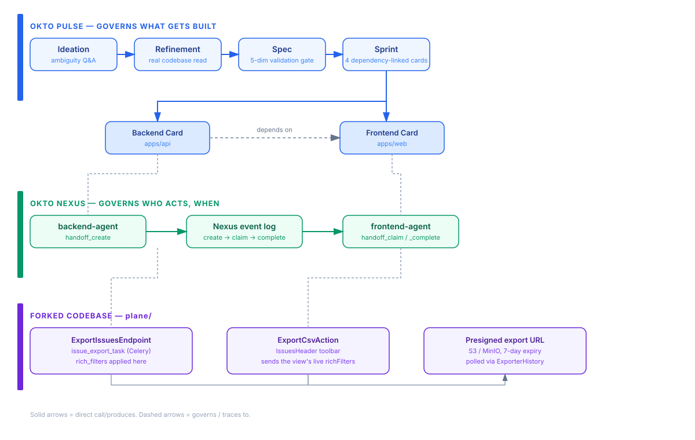

<p align="center">
  
</p>

# okto-plane-handoff-demo

One real feature. Two agent roles. A spec-gated pipeline that decides what's
built and what "done" means, plus a coordination layer that decides who gets
to touch it, and when.

A real feature, built on a real codebase, governed end-to-end by Okto Pulse
and Okto Nexus together.

**Status: a live run, captured mid-flight, at roughly the halfway point.**
The repo ships exactly where the run currently stands — see
[What's Next](#whats-next) for the concrete next steps, written so a
reader can pick up and continue rather than just read about it.

## About Okto Pulse + Okto Nexus

**Okto Pulse** is a spec-gated SDLC pipeline for AI coding agents — it
governs the path from a raw idea to a validated, evidence-backed "done":
ideation → refinement → spec → validation gate → sprint → cards → task
validation.

**Okto Nexus** is a local-first coordination layer for teams running
multiple AI coding agents — it governs how agents claim work, hand it to
each other, and leave an auditable trail of who did what and when.

Independently, either product answers half the question "what does it look
like when AI agents build real software." Together: a spec-gated card,
handed off between two independently-running agents, with an audit trail
proving the handoff happened and the evidence that satisfied the validation
gate.

## The Problem

Teams evaluating "AI agents for software delivery" get stuck choosing
between two half-answers:

1. **Governance tools track work but don't touch coordination** — a backlog
   of AI-generated tickets with no structural guarantee two agents don't
   collide, or that a handoff between them is real and auditable.
2. **Coordination tools let agents talk but have no gated proof of "done"**
   — agents can pass work to each other, but nothing structurally verifies
   the claim before it ships.
3. **Ambiguity gets silently absorbed into code** — an agent's first
   reading of a feature request becomes an assumption baked into the
   implementation, with no record of the reasoning or the alternative
   paths considered.
4. **Coordination context dies with the session** — chat transcripts
   aren't durable, auditable storage.

## How It Works

The feature: wire Plane's Issues List view to its own existing async CSV
export pipeline, filtered to whatever the view's active filters/sort
currently show.

- **Pulse** owns *what to build*: the ideation is investigated and refined
  against the real codebase before a line of code is written, the spec is
  validated against five deterministic quality dimensions, and every
  card's completion claim goes through an independent task-validation
  gate before it counts as done.
- **Nexus** owns *who's allowed to act and when*: the backend agent hands
  off to the frontend agent with the real API contract as the artifact,
  and the handoff's claim/complete trail is a real, replayable event log.

## Pulse + Nexus in Action

<p align="center">
  
</p>

The real state behind this diagram is in `demo-state/`:

- `demo-state/board-export.json` — the board, card list, and sprint/spec
  lineage
- `demo-state/spec-export.json` — the full validated spec: 8 functional
  requirements, 5 technical requirements, 6 acceptance criteria, 6 business
  rules, 1 API contract, and the formal Decision entity — every one linked
  to a real task card
- `demo-state/nexus-event-log.json` — the real handoff: `handoff_create` →
  `handoff_claim` → `handoff_complete`, with the actual result payload the
  frontend agent reported back
- `demo-state/nexus-workspace-config.json` — the registered agent roster

## Architecture

Pulse and Nexus stay architecturally independent — no import, network call,
or config flag connects their codebases. The only connection is a single
agent client (here: one Claude Code session, playing both `backend-agent`
and `frontend-agent`) holding both MCP server URLs simultaneously, working
against the same `plane/` checkout. See `docs/architecture.md` for the full
breakdown, including the exact integration points inside Plane's own code.

## Repository Structure

```
okto-plane-handoff-demo/
├── plane/                    forked target app (github.com/yuvicodesgit/plane,
│                              branch feature/issue-csv-export), embedded here
│                              so the repo is self-contained — retains its own
│                              AGPL-3.0 license (see plane/LICENSE.md)
├── demo-state/                real Pulse board/spec state + Nexus event log
│   ├── board-export.json
│   ├── spec-export.json
│   ├── nexus-event-log.json
│   └── nexus-workspace-config.json
├── docs/
│   ├── architecture.md        Pulse + Nexus integration, real code citations
│   ├── walkthrough.md         the actual MCP call trace, stage by stage
│   ├── decisions/              real decisions made during the run
│   ├── prompts/                the actual prompt used at each stage
│   └── assets/                 banner + architecture diagram
├── scripts/setup.sh           bootstrap: plane + pulse + nexus, one command
├── .env.example
├── .mcp.json.example
└── LICENSE
```

## Workspace & Demo Data

- **Demo name:** `okto-plane-handoff-demo`
- **Target app:** a fork of [`makeplane/plane`](https://github.com/makeplane/plane)
  (Django API + React/Vite web, ~35k stars), branch `feature/issue-csv-export`
- **Feature:** filter-aware CSV export on the Issues List view, wired into
  Plane's own existing (previously unused) async export pipeline
- **Pulse board:** `My Board` — 1 ideation, 1 refinement, 1 spec, 1 sprint,
  4 cards
- **Nexus workspace:** resolved from `plane/`'s absolute path; agents
  `spec-agent`, `backend-agent`, `frontend-agent`, `validator-agent`
  registered

## Roles

| Role | Pulse preset | Nexus identity | Client | Did |
|---|---|---|---|---|
| Spec Agent | Spec | `spec-agent` | Claude Code | Ideation, refinement, spec authoring and validation |
| Backend Agent | Executor | `backend-agent` | Claude Code | Implemented the export endpoint + Celery task extension, ran real tests inside the project's own docker-compose stack |
| Frontend Agent | Executor | `frontend-agent` | Claude Code (standing in for Cursor) | Claimed the real Nexus handoff, implemented the toolbar action against the delivered contract |
| Validator Agent | Validator | `validator-agent` | Claude Code | Submitted task validations against Pulse's deterministic thresholds |

## Tools Used

- **Okto Pulse** — spec-gated SDLC pipeline (ideation, refinement, spec,
  validation gate, sprint, cards, task validation)
- **Okto Nexus** — agent coordination bus (handoffs, event log, agent
  presence)
- **Claude Code** — the agent client, connected to both MCP servers
  simultaneously
- **Plane** — the target application (Django + DRF backend, React/Vite
  frontend, Celery async jobs, S3/MinIO storage)
- **Docker Compose** — Plane's own local dev stack (Postgres, Redis,
  RabbitMQ, MinIO)
- **pytest**, **Playwright** — backend and frontend test coverage

## Prerequisites

- Python 3.11+: `pip install okto-pulse` and `pip install "okto-nexus[serve]"`
- Docker + Docker Compose v2
- Node.js 18+, `pnpm`
- Two separate agent connections (or one client holding both MCP server
  URLs simultaneously, as this run did)

## Quickstart

```bash
git clone https://github.com/Infrasity-Labs/okto-plane-handoff-demo.git
cd okto-plane-handoff-demo
cp .env.example .env
cp .mcp.json.example .mcp.json   # fill in real agent keys after registering them
./scripts/setup.sh
```

This scaffolds Plane's env files, brings up its docker-compose stack, and
starts Pulse and Nexus pointed at the embedded `plane/` checkout.

## Running the target app (`plane/`)

Once `scripts/setup.sh` has brought the stack up:

```bash
open http://localhost         # Plane itself, via the proxy
open http://127.0.0.1:8100    # Pulse dashboard
open http://127.0.0.1:8202    # Nexus dashboard
```

`docs/walkthrough.md` has the exact commands used to run the backend's real
test suite inside the project's own containers, and to bootstrap
authenticated test sessions for the frontend.

## Stages (as actually run)

0. **Setup** — fork, scaffold, bring up Plane's stack, register Pulse/Nexus
   agent identities
1. **Ideate** (Pulse) — ambiguity-killer Q&A before writing anything down
   (`docs/prompts/01-ideation-ambiguity-killer.md`)
2. **Refine** (Pulse) — real codebase investigation informs the design
   (`docs/prompts/02-refinement-investigation.md`,
   `docs/decisions/01-ideation-refined-by-investigation.md`)
3. **Spec** (Pulse) — authored, KG-checked, pushed through the five-
   dimension validation gate — passes at 85/86/84/85/18
4. **Sprint** (Pulse) — 4 cards created and dependency-linked
5. **Backend implementation** — real code, real tests, card reaches `done`
6. **Handoff** (Nexus) — backend → frontend, contract artifact
   (`docs/prompts/03-nexus-handoff-payload.md`)
7. **Frontend implementation** — real code against the delivered contract,
   with a real contract refinement reported back through the handoff
   (`docs/decisions/02-contract-refined-during-handoff.md`)
8. **Task validation gate** — demonstrated live: the gate enforces its
   completeness threshold independently of the reviewer's own
   recommendation (`docs/decisions/03-validation-gate-enforces-its-threshold.md`)
9. **Extending test coverage** — Playwright added, the export pipeline
   verified end-to-end against live infrastructure
   (`docs/decisions/04-scoping-the-remaining-e2e-pass.md`)

## Where to Find Artifacts

- `demo-state/` — real Pulse board/spec state and the real Nexus handoff
  event log
- `docs/walkthrough.md` — stage-by-stage instructions and the full MCP
  call trace
- `docs/prompts/` — the actual prompt for each stage
- `docs/decisions/` — the real decisions made along the way
- `plane/` — the forked app itself, branch `feature/issue-csv-export`,
  also pushed standalone to
  [yuvicodesgit/plane](https://github.com/yuvicodesgit/plane)

## What's Next

This run is captured at roughly the halfway point on purpose — there's real
work here for whoever picks it up:

- [ ] Complete the Playwright e2e pass for the Frontend card's two test
      scenarios (permission-gated visibility, completed/failed polling
      states) — the suite is written and committed
      (`plane/apps/web/e2e/export-csv.spec.ts`); see
      `docs/decisions/04-scoping-the-remaining-e2e-pass.md` for the exact
      next step.
- [ ] Resubmit the Frontend card's task validation once that evidence
      exists, and move it to `done`.
- [ ] Close the Sprint and Spec once both implementation cards are `done`.
- [ ] Open the real PR to `makeplane/plane` — the feature itself, plus two
      independent local-environment improvements found along the way (see
      `docs/architecture.md`).

## Contributing & Licensing

This repo's own content (docs, scripts, demo-state) is licensed under the
[Elastic License 2.0](LICENSE), matching Okto Pulse and Okto Nexus. The
embedded `plane/` directory is a fork of
[`makeplane/plane`](https://github.com/makeplane/plane) and retains its own
AGPL-3.0 license — see `plane/LICENSE.md`.

Contributions welcome via PR against
[Infrasity-Labs/okto-plane-handoff-demo](https://github.com/Infrasity-Labs/okto-plane-handoff-demo).

## Conclusion

Built on [Okto Pulse](https://github.com/OktoLabsAI/okto-pulse) and
[Okto Nexus](https://github.com/OktoLabsAI/okto-nexus), both OktoLabs
products. Structural separation between what gets built, what counts as
proof it works, and who's allowed to touch it next — enforced by the tools
themselves.
