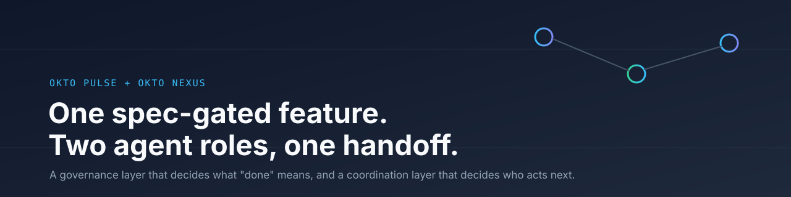
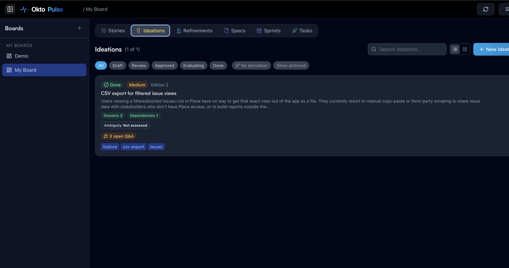
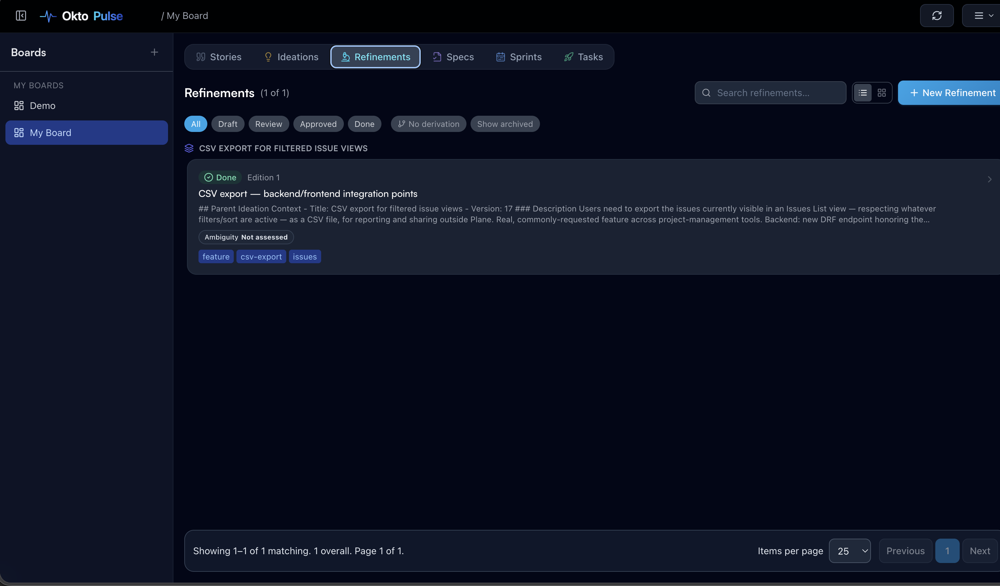
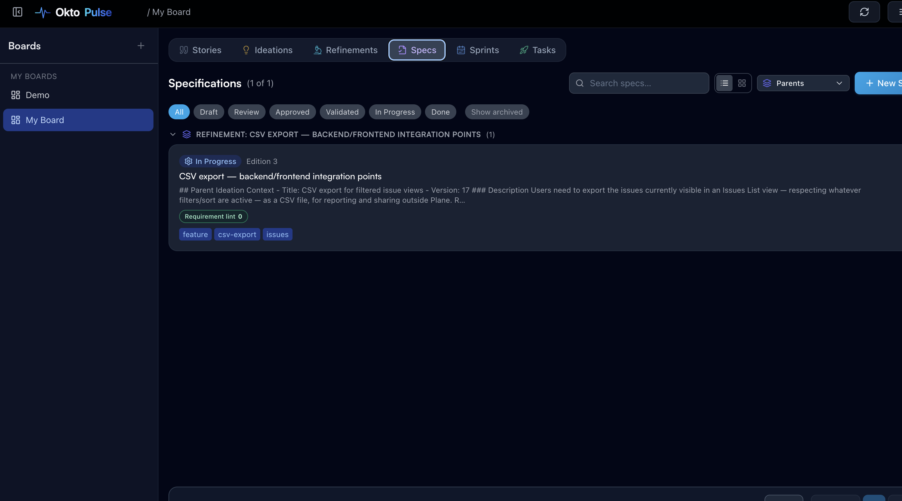
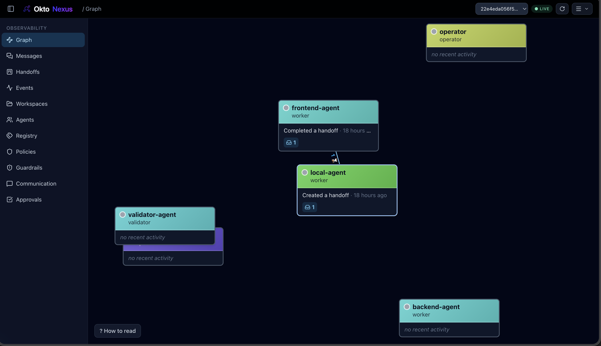
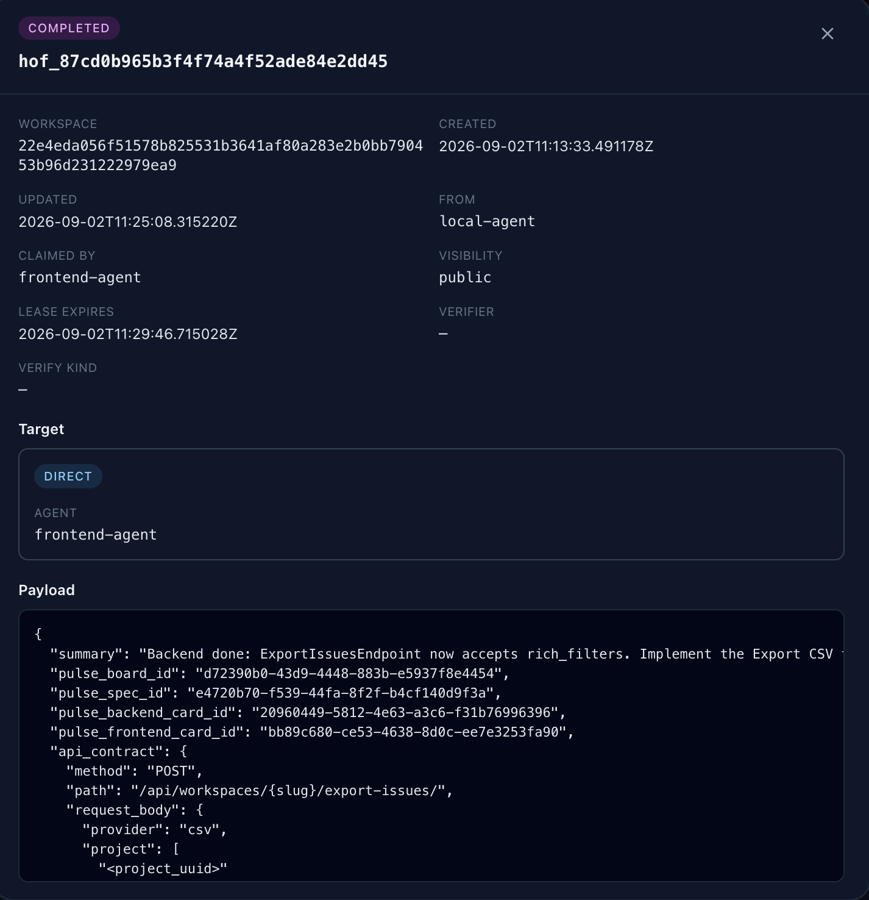
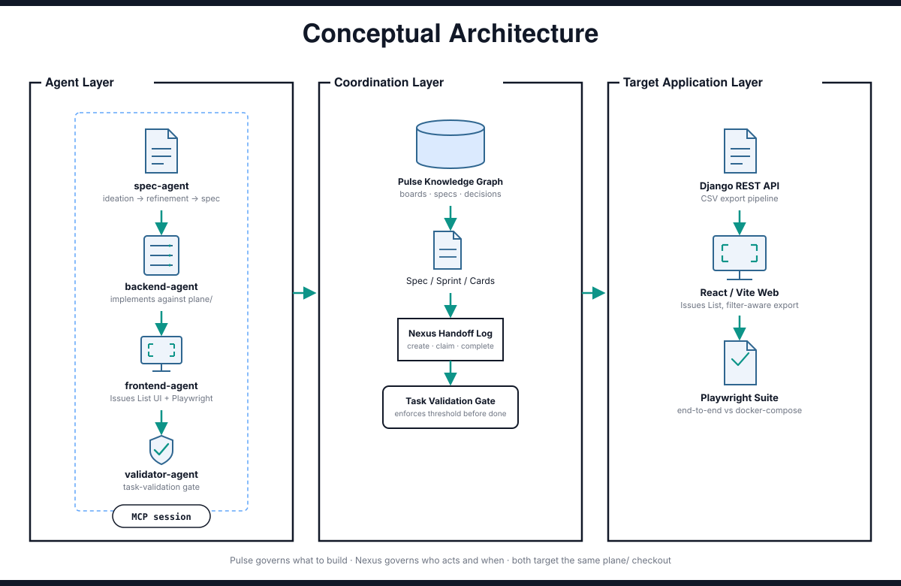

<div align="center">
  

  <br/>
  <br/>

  <p>
    <a href="LICENSE">
      
    </a>
    &nbsp;
    <a href="https://github.com/OktoLabsAI/okto-pulse">
      
    </a>
    &nbsp;
    <a href="https://github.com/OktoLabsAI/okto-nexus">
      
    </a>
    &nbsp;
    <a href="https://docs.oktolabs.ai">
      
    </a>
    &nbsp;
    <a href="https://github.com/makeplane/plane">
      
    </a>
  </p>

  <h3>One real feature. Two agent roles. One coordination layer.</h3>

  <p>
    A spec-gated pipeline that decides what's built and what "done" means,
    handed off through a coordination layer that decides who gets to touch
    it and when, governing a real feature on a real forked codebase.
  </p>

  <p>
    <a href="#about-okto-pulse--okto-nexus"><b>About</b></a> &nbsp;·&nbsp;
    <a href="#the-problem"><b>The Problem</b></a> &nbsp;·&nbsp;
    <a href="#how-it-works"><b>How It Works</b></a> &nbsp;·&nbsp;
    <a href="#pulse--nexus-in-action"><b>In Action</b></a> &nbsp;·&nbsp;
    <a href="#architecture"><b>Architecture</b></a> &nbsp;·&nbsp;
    <a href="#workspace--demo-data"><b>Demo Data</b></a> &nbsp;·&nbsp;
    <a href="#roles"><b>Roles</b></a> &nbsp;·&nbsp;
    <a href="#tools-used"><b>Tools Used</b></a> &nbsp;·&nbsp;
    <a href="#prerequisites"><b>Prerequisites</b></a> &nbsp;·&nbsp;
    <a href="#quickstart"><b>Quickstart</b></a> &nbsp;·&nbsp;
    <a href="#running-the-target-app-plane"><b>Running Plane</b></a> &nbsp;·&nbsp;
    <a href="#stages-as-actually-run"><b>Stages</b></a> &nbsp;·&nbsp;
    <a href="#where-to-find-artifacts"><b>Artifacts</b></a> &nbsp;·&nbsp;
    <a href="#whats-next"><b>What's Next</b></a> &nbsp;·&nbsp;
    <a href="#security"><b>Security</b></a> &nbsp;·&nbsp;
    <a href="#related"><b>Related</b></a>
  </p>
</div>

<br/>

---

**Status: a live run, captured mid-flight, at roughly the halfway point.** The repo ships exactly where the run currently stands: see [What's Next](#whats-next) for the concrete next steps, written so a reader can pick up and continue rather than just read about it.

<br/>

---

## About Okto Pulse + Okto Nexus

**Okto Pulse** is a spec-gated SDLC pipeline for AI coding agents: it governs the path from a raw idea to a validated, evidence-backed "done": ideation → refinement → spec → validation gate → sprint → cards → task validation.

**Okto Nexus** is a local-first coordination layer for teams running multiple AI coding agents: it governs how agents claim work, hand it to each other, and leave an auditable trail of who did what and when.

Independently, either product answers half the question "what does it look like when AI agents build real software." Together: a spec-gated card, handed off between two independently-running agents, with an audit trail proving the handoff happened and the evidence that satisfied the validation gate.

Pulse and Nexus are architecturally independent, with no shared code, config, or service. Each is a design precedent for the other, not a dependency.

<br/>

---

## The Problem

Teams evaluating "AI agents for software delivery" get stuck choosing between two half-answers. This repo tests each gap directly, not just describes it:

| Failure mode | Where it shows up here | Why it happens |
| :--- | :--- | :--- |
| Governance tools track work but don't touch coordination | A Pulse card can reach `done` with no structural guarantee the handoff to the next agent ever happened, or was real | A backlog of AI-generated tickets has no atomic claim/handoff primitive, that's a coordination problem, not a spec problem |
| Coordination tools let agents talk but have no gated proof of "done" | The frontend card's first task-validation submission, completeness 78, board threshold 80 | Agents can pass work to each other, but nothing structurally verifies the claim before it counts; "the agent said it's done" isn't evidence |
| Ambiguity gets silently absorbed into code | The ideation's sync/async threshold, CSV column set, and signed-URL expiry, all three wrong until Q&A caught them | An agent's first reading of a feature request becomes an assumption baked into the implementation, with no record of the reasoning or the alternatives considered |
| Coordination context dies with the session | The Nexus handoff's `session.opened` → `handoff.claimed` → `handoff.completed` trail | A chat transcript isn't durable, auditable storage; kill the process and the claim, the reasoning, and the in-progress state are gone with it |

Pulse's validation gates and Nexus's handoffs exist specifically to close these gaps, structurally, not by asking an agent to remember a rule.

<br/>

---

## How It Works

The feature: wire Plane's Issues List view to its own existing async CSV export pipeline, filtered to whatever the view's active filters/sort currently show.

- **Pulse** owns *what to build*: the ideation is investigated and refined against the real codebase before a line of code is written, the spec is validated against five deterministic quality dimensions, and every card's completion claim goes through an independent task-validation gate before it counts as done.
- **Nexus** owns *who's allowed to act and when*: the backend agent hands off to the frontend agent with the real API contract as the artifact, and the handoff's claim/complete trail is a real, replayable event log.

1. **Ideate, ambiguity-killed.** Three open questions (sync/async threshold, CSV columns, signed-URL expiry) resolved via Q&A before `problem_statement` is written.
2. **Refine against real code.** A subagent reads the actual forked `plane/` source and finds a complete, unused async export pipeline already exists: three of the ideation's assumptions get superseded on the spot.
3. **Spec, validated.** 8 functional requirements, 5 technical requirements, 6 acceptance criteria, 6 business rules, 1 API contract: every one traced to a real card, passing Pulse's five-dimension gate at 85/86/84/85/18.
4. **Sprint, 4 cards.** Backend, Frontend, and their two dependent test cards, assigned and made active.
5. **Backend implementation.** Real code, real pytest run (17/17), card reaches `done`.
6. **Nexus handoff.** `handoff_create` (API contract as payload) → `handoff_claim` → `handoff_complete`, with a real contract refinement reported back through the completion payload.
7. **Frontend implementation.** Real code against the delivered contract, verified by a clean workspace typecheck.
8. **Task validation gate enforces its threshold.** Submitted at an honest `completeness=78`: the gate rejects it regardless of the reviewer's own "approve" recommendation, because 78 is less than the board's 80.
9. **Extending test coverage.** Playwright added, the export pipeline verified end-to-end against live infrastructure, a real regression caught and fixed along the way.

<br/>

---

## Pulse + Nexus in Action

The real state behind this run is in [`demo-state/`](demo-state/): see [`demo-state/README.md`](demo-state/README.md) for what each file is and how to view it.

- **Pulse board**: 1 ideation, 1 refinement, 1 spec (validated → in_progress), 1 active sprint, 4 cards: 2 `done`, 1 `rejected`, 1 `not_started`
- **The full validated spec**: every functional requirement, technical requirement, acceptance criterion, business rule, the API contract, and the formal Decision entity, each linked to a real task card
- **The real Nexus handoff**: `handoff_create` → `handoff_claim` → `handoff_complete`, with the actual contract-refinement result payload the frontend agent reported back
- **The registered Nexus agent roster**: `spec-agent`, `backend-agent`, `frontend-agent`, `validator-agent`

**Pulse: Ideation and Refinement, both done.** Scope evaluated (Domains 2, Dependencies 1), ambiguity-killer Q&A resolved on the left; the real codebase investigation that superseded three of the ideation's assumptions on the right.

<table>
<tr>
<td width="50%" align="center"><sub><b>Ideations tab</b></sub></td>
<td width="50%" align="center"><sub><b>Refinements tab</b></sub></td>
</tr>
<tr>
<td width="50%"></td>
<td width="50%"></td>
</tr>
</table>

**Pulse: Spec, in progress.** Validated, content-locked, Requirement Lint at 0 defects, decomposed into the active sprint's 4 cards.

<div align="center">
  
</div>

**Nexus: the coordination graph and the real handoff, completed.** `frontend-agent` and the session's fallback `local-agent` identity show real handoff activity on the left; `spec-agent`, `backend-agent`, and `validator-agent` are registered but show no Nexus activity, because their work happened entirely on Pulse's side. Nexus only governs the one backend→frontend handoff in this run, and even that got created under `local-agent` rather than `backend-agent` due to an MCP session-reconnect quirk (see `docs/walkthrough.md`). The handoff detail on the right shows the real API contract payload and the contract refinement reported back on completion.

<table>
<tr>
<td width="50%" align="center"><sub><b>Coordination graph</b></sub></td>
<td width="50%" align="center"><sub><b>Handoff detail, COMPLETED</b></sub></td>
</tr>
<tr>
<td width="50%"></td>
<td width="50%"></td>
</tr>
</table>

<br/>

---

## Architecture

<div align="center">
  
</div>

Pulse and Nexus share no code, config, or service; the only connection is this one agent client holding both MCP server URLs simultaneously, working against the same `plane/` checkout. See [`docs/architecture.md`](docs/architecture.md) for the full breakdown, including the exact integration points inside Plane's own code.

<br/>

---

## Workspace & Demo Data

| Field | Value |
| :--- | :--- |
| Demo name | `okto-plane-handoff-demo` |
| Target app | Fork of [`makeplane/plane`](https://github.com/makeplane/plane) (Django API + React/Vite web, ~35k stars), branch `feature/issue-csv-export` |
| Feature | Filter-aware CSV export on the Issues List view, wired into Plane's own existing (previously unused) async export pipeline |
| Pulse board | `My Board`: 1 ideation, 1 refinement, 1 spec, 1 sprint, 4 cards |
| Nexus workspace | Resolved from `plane/`'s absolute path; agents `spec-agent`, `backend-agent`, `frontend-agent`, `validator-agent` registered |

<br/>

---

## Roles

| Role | Pulse preset | Nexus identity | Client | Did |
| :--- | :--- | :--- | :--- | :--- |
| Spec Agent | Spec | `spec-agent` | Claude Code | Ideation, refinement, spec authoring and validation |
| Backend Agent | Executor | `backend-agent` | Claude Code | Implemented the export endpoint + Celery task extension, ran real tests inside the project's own docker-compose stack |
| Frontend Agent | Executor | `frontend-agent` | Claude Code (standing in for Cursor) | Claimed the real Nexus handoff, implemented the toolbar action against the delivered contract |
| Validator Agent | Validator | `validator-agent` | Claude Code | Submitted task validations against Pulse's deterministic thresholds |

<br/>

---

## Tools Used

| Tool | Used for |
| :--- | :--- |
| `okto_pulse_create_ideation` / `evaluate_ideation` / `move_ideation` | Ideation lifecycle and ambiguity-killer Q&A |
| `okto_pulse_create_refinement` / `derive_spec_from_refinement` | Turning investigated codebase reality into a spec |
| `okto_pulse_submit_spec_validation` / `submit_spec_evaluation` | The five-dimension validation gate and qualitative evaluation |
| `okto_pulse_create_sprint` / `create_card` / `submit_task_validation` | Sprint decomposition and the per-card completion gate |
| `handoff_create` / `handoff_claim` / `handoff_complete` | The real Nexus handoff carrying the API contract |
| `session_open` / `event_get` / `event_cursor` | Establishing agent identity and replaying the handoff event log |

<br/>

---

## Prerequisites

| Requirement | Notes |
| :--- | :--- |
| Python 3.11+ | `pip install okto-pulse` and `pip install "okto-nexus[serve]"` |
| Docker + Docker Compose v2 | Required for Plane's stack (API, web, live, Postgres, Redis, MinIO, RabbitMQ) |
| Node.js 18+, `pnpm` | Required by Plane's own build |
| Two separate agent connections | Or one client holding both MCP server URLs simultaneously, as this run did |

<br/>

---

## Quickstart

### 1. Install Okto Pulse and Okto Nexus

```bash
pip install okto-pulse
pip install "okto-nexus[serve]"
```

### 2. Clone and install script dependencies

```bash
git clone https://github.com/Infrasity-Labs/okto-plane-handoff-demo.git
cd okto-plane-handoff-demo
python3 -m venv .venv && source .venv/bin/activate
pip install -r scripts/requirements.txt
cp .env.example .env
cp .mcp.json.example .mcp.json   # fill in real agent keys after registering them
```

> [!NOTE]
> `.mcp.json` needs real `dash_...` (Pulse) and `nxs_...` (Nexus) agent keys, not the placeholders in `.mcp.json.example`. You won't have those until agents are registered in step 3, so come back and fill this in afterward.

### 3. Bring up the stack

```bash
./scripts/00_setup.sh
```

This scaffolds Plane's env files, brings up its docker-compose stack, and starts Pulse and Nexus pointed at the embedded `plane/` checkout.

> [!NOTE]
> Requires Docker Desktop (or an equivalent daemon) already running. `scripts/00_setup.sh` fails fast with a clear message if it isn't.

### 4. Seed the Pulse board

Once `okto-pulse serve` has printed its first-boot API key, seed the board to this repo's halfway-point state:

```bash
python3 scripts/01_seed_pulse_board.py --api-key dash_<your-pulse-agent-key>
```

This replays the same final field values (requirements, business rules, the API contract, decision, test scenarios, mockup, card statuses) through the real Pulse MCP tool calls: see [`demo-state/README.md`](demo-state/README.md) for exactly what it does and doesn't cover. It does **not** register or connect Nexus agents, and does not replay the Nexus handoff event log: do that yourself per [`docs/walkthrough.md`](docs/walkthrough.md)'s "Nexus handoff" section, the same as the original run did.

> [!WARNING]
> Run this exactly once against a fresh board. It has no idempotency guard; a second run creates a second copy of every entity.

<br/>

---

## Running the target app (`plane/`)

Once `scripts/00_setup.sh` has brought the stack up:

```bash
open http://localhost         # Plane itself, via the proxy
open http://127.0.0.1:8100    # Pulse dashboard
open http://127.0.0.1:8202    # Nexus dashboard
```

`docs/walkthrough.md` has the exact commands used to run the backend's real test suite inside the project's own containers, and to bootstrap authenticated test sessions for the frontend.

<br/>

---

## Stages (as actually run)

| Stage | What happens | Prompt / doc |
| :--- | :--- | :--- |
| 0. Setup | Fork, scaffold, bring up Plane's stack, register Pulse/Nexus agent identities | `scripts/00_setup.sh` |
| 1. Ideate | Ambiguity-killer Q&A before writing anything down | `docs/prompts/01-ideation-ambiguity-killer.md` |
| 2. Refine | Real codebase investigation informs the design | `docs/prompts/02-refinement-investigation.md`, `docs/decisions/01-ideation-refined-by-investigation.md` |
| 3. Spec | Authored, KG-checked, pushed through the five-dimension validation gate, passes at 85/86/84/85/18 | - |
| 4. Sprint | 4 cards created and dependency-linked | - |
| 5. Backend implementation | Real code, real tests, card reaches `done` | - |
| 6. Handoff | Backend → frontend, contract artifact | `docs/prompts/03-nexus-handoff-payload.md` |
| 7. Frontend implementation | Real code against the delivered contract, with a real contract refinement reported back through the handoff | `docs/decisions/02-contract-refined-during-handoff.md` |
| 8. Task validation gate | Demonstrated live: the gate enforces its completeness threshold independently of the reviewer's own recommendation | `docs/decisions/03-validation-gate-enforces-its-threshold.md` |
| 9. Extending test coverage | Playwright added, the export pipeline verified end-to-end against live infrastructure | `docs/decisions/04-scoping-the-remaining-e2e-pass.md` |

<br/>

---

## Where to Find Artifacts

- [`demo-state/`](demo-state/): real Pulse board/spec state and the real Nexus handoff event log
- [`docs/walkthrough.md`](docs/walkthrough.md): stage-by-stage instructions and the full MCP call trace
- [`docs/prompts/`](docs/prompts/): the actual prompt for each stage
- [`docs/decisions/`](docs/decisions/): the real decisions made along the way
- `plane/`: the forked app itself, branch `feature/issue-csv-export`

<br/>

---

## What's Next

This run is captured at roughly the halfway point on purpose; steps for moving ahead:

- [ ] Complete the Playwright e2e pass for the Frontend card's two test scenarios (permission-gated visibility, completed/failed polling states). The suite is written and committed (`plane/apps/web/e2e/export-csv.spec.ts`); see `docs/decisions/04-scoping-the-remaining-e2e-pass.md` for the exact next step.
- [ ] Resubmit the Frontend card's task validation once that evidence exists, and move it to `done`.
- [ ] Close the Sprint and Spec once both implementation cards are `done`.
<br/>

---

## Security

> [!WARNING]
> Never commit `.env` or `.mcp.json` with real keys filled in. Both are covered by `.gitignore`; commit only the `.env.example` / `.mcp.json.example` templates.

- Rotate any `dash_...` (Pulse) or `nxs_...` (Nexus) agent key that appears in terminal output, git history, or chat exports.
- Pulse (`:8100`/`:8101`) and Nexus (`:8202`) bind to `127.0.0.1` by default in this setup; don't expose them beyond localhost without adding your own auth in front.
- To purge a committed secret from git history: `git filter-repo --invert-paths --path .env` then force-push.

<br/>

---

## Contributing & Licensing

This repo's own content (docs, scripts, demo-state) is licensed under the [Elastic License 2.0](LICENSE), matching Okto Pulse and Okto Nexus. The embedded `plane/` directory is a fork of [`makeplane/plane`](https://github.com/makeplane/plane) and retains its own AGPL-3.0 license: see `plane/LICENSE.md`.

To reproduce or iterate: fork this repo, run `scripts/00_setup.sh` and `scripts/01_seed_pulse_board.py` against your own Pulse instance, connect your own Backend and Frontend agents to your own Nexus instance.

Contributions welcome via PR against [Infrasity-Labs/okto-plane-handoff-demo](https://github.com/Infrasity-Labs/okto-plane-handoff-demo).

<br/>

---

## Related

| Project | Description |
| :--- | :--- |
| [OktoLabsAI/okto-pulse](https://github.com/OktoLabsAI/okto-pulse) | Okto Pulse open source (Elastic License 2.0) |
| [OktoLabsAI/okto-nexus](https://github.com/OktoLabsAI/okto-nexus) | Okto Nexus open source (Elastic License 2.0) |
| [Infrasity-Labs/nexus-brownfield-use-case](https://github.com/Infrasity-Labs/nexus-brownfield-use-case) | Reference repo for Nexus alone: two agents racing a policy-gated migration handoff |
| [makeplane/plane](https://github.com/makeplane/plane) | The upstream project this demo's `plane/` fork is based on |
| [Okto Labs documentation](https://docs.oktolabs.ai) | Full docs for both products |

<br/>

---

<div align="center">
  <p>
    Built on <a href="https://github.com/OktoLabsAI/okto-pulse"><b>Okto Pulse</b></a> and <a href="https://github.com/OktoLabsAI/okto-nexus"><b>Okto Nexus</b></a>, open-source agent SDLC governance and coordination.
    <br/>
    <a href="https://github.com/OktoLabsAI/okto-pulse/blob/main/LICENSE">Source (Elastic License 2.0)</a> &nbsp;·&nbsp;
    <a href="https://docs.oktolabs.ai">Documentation</a> &nbsp;·&nbsp;
    <a href="https://oktolabs.ai">OktoLabs</a>
  </p>
</div>
